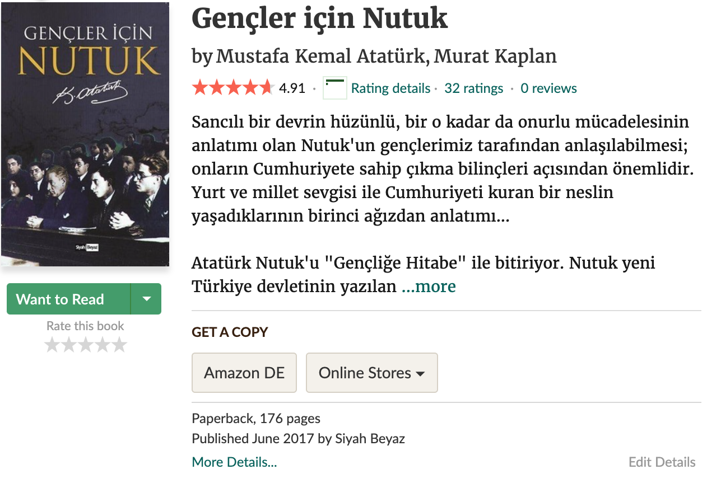
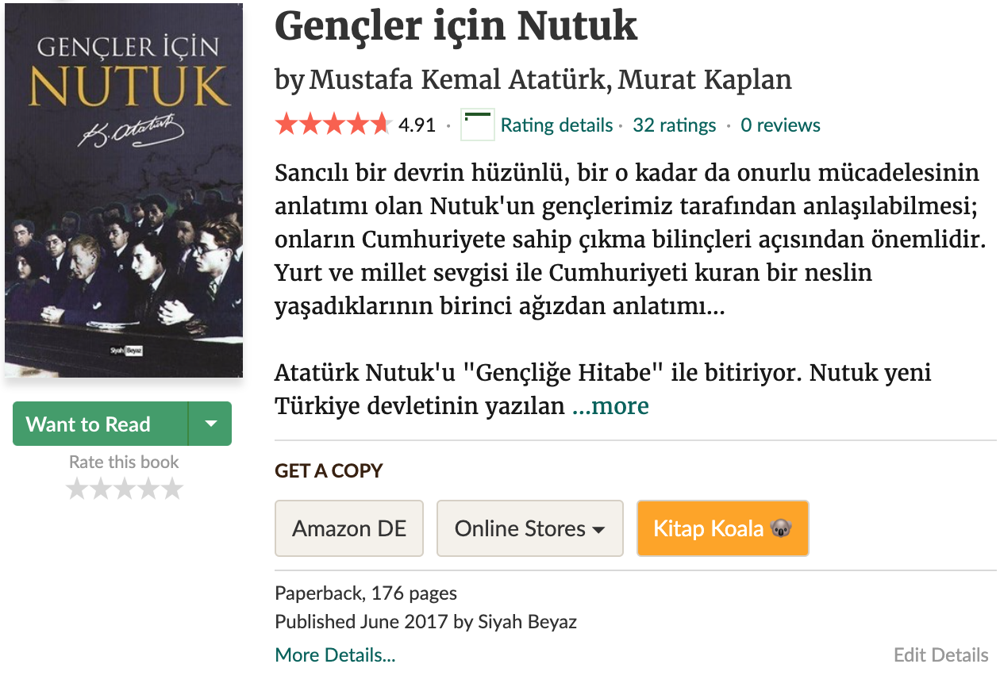
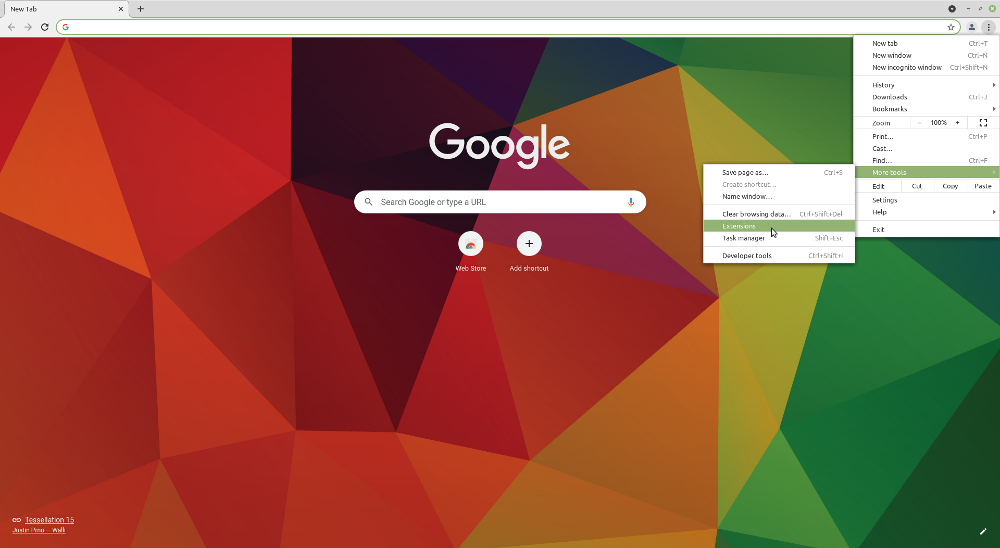
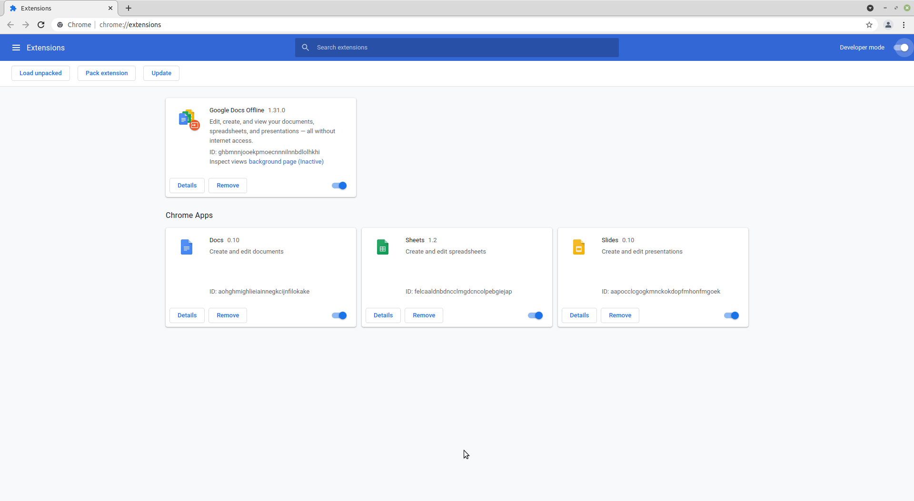
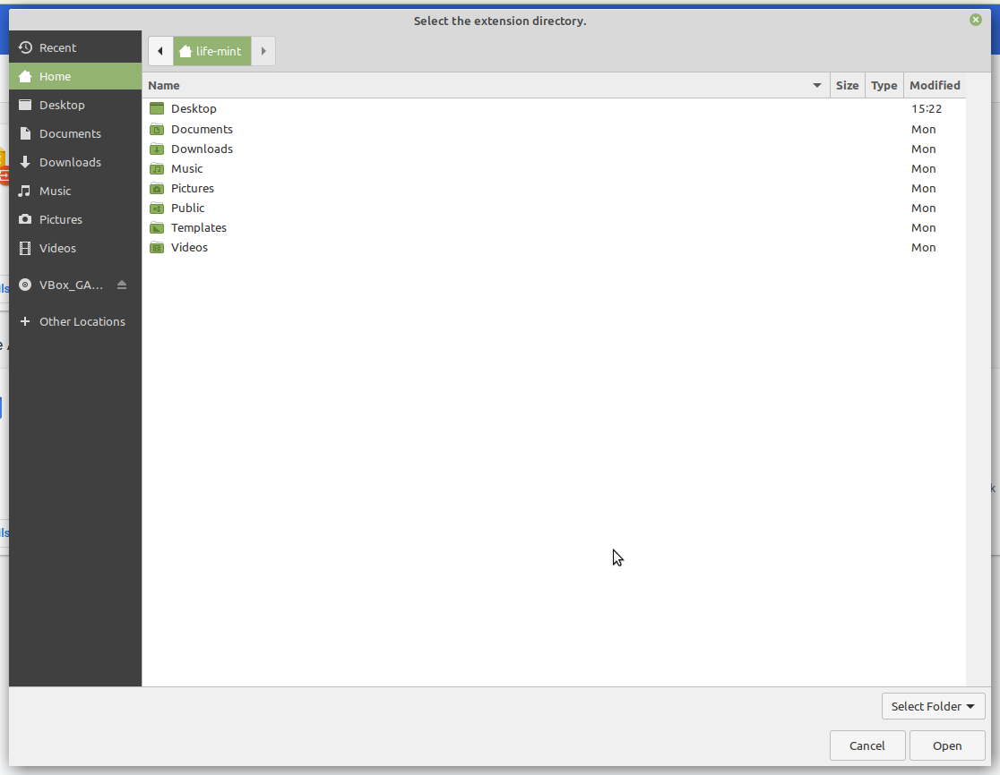
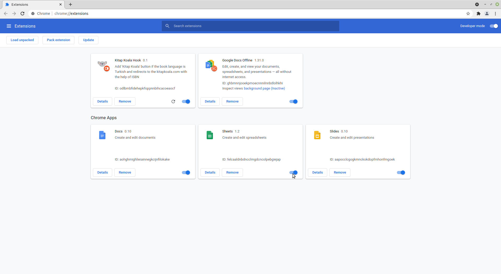

# Goodreads Kitap Koala Hook

It's a Chrome extension that adds a button to Goodreads' book detail page that shows the book on [Kitap Koala](https://kitapkoala.com). There is an Amazon button on the book details page to buy a copy of the related book from Amazon web site. As [goodreads](https://goodreads.com) belongs to Amazon, that is understandable. But, I decided to add another button to see and possibly buy that related book from my favorite online bookstore which is [Kitap Koala](https://kitapkoala.com). 


w/o Kitap Koala button                           |  with Kitap Koala button
:-----------------------------------------------:|:-------------------------------------------------:
 |  

## Why Kitap Koala

Since its establishment, it has undertaken the treatment of many animals upon application. It has undertaken the delivery of pending books, which it sells through its members, to schools and mediated the delivery of suspended foods to shelters. Therefore, I decided to buy printed books from them as much as possible. For more details, please check their [about us](https://www.kitapkoala.com/sayfa/hakkimizda) page.

## How to install

### From the source code

You have to clone the repository to your local machine

```shell
git clone git@github.com:volkan-labs/goodreads-kitap-koala-hook.git
```

* Open you Chrome extensions from the menu like below



or with writing `chrome://extensions` to the URL bar.

* Enable `Developer mode` from the top right button, thiw will show you some extra button on top of the page



* Click the `Load unpacked` button and select the directory of the repository



* When you select the repository directory, you will be able to see the extension that is already installed



## Issues

You can create an issue if you find any problem or feel free to create a PR with a possible fix or any other feature. Also, you can create an issue if you have any idea that you think it will be nice if we have it.

## Credits

[Icons](https://www.flaticon.com/de/kostenloses-icon/koala_826903) created by [Freepik](https://www.freepik.com) from [flaticon](https://www.flaticon.com/de/).

## Author

* Volkan Tokmak - [volkanto](https://github.com/volkanto)